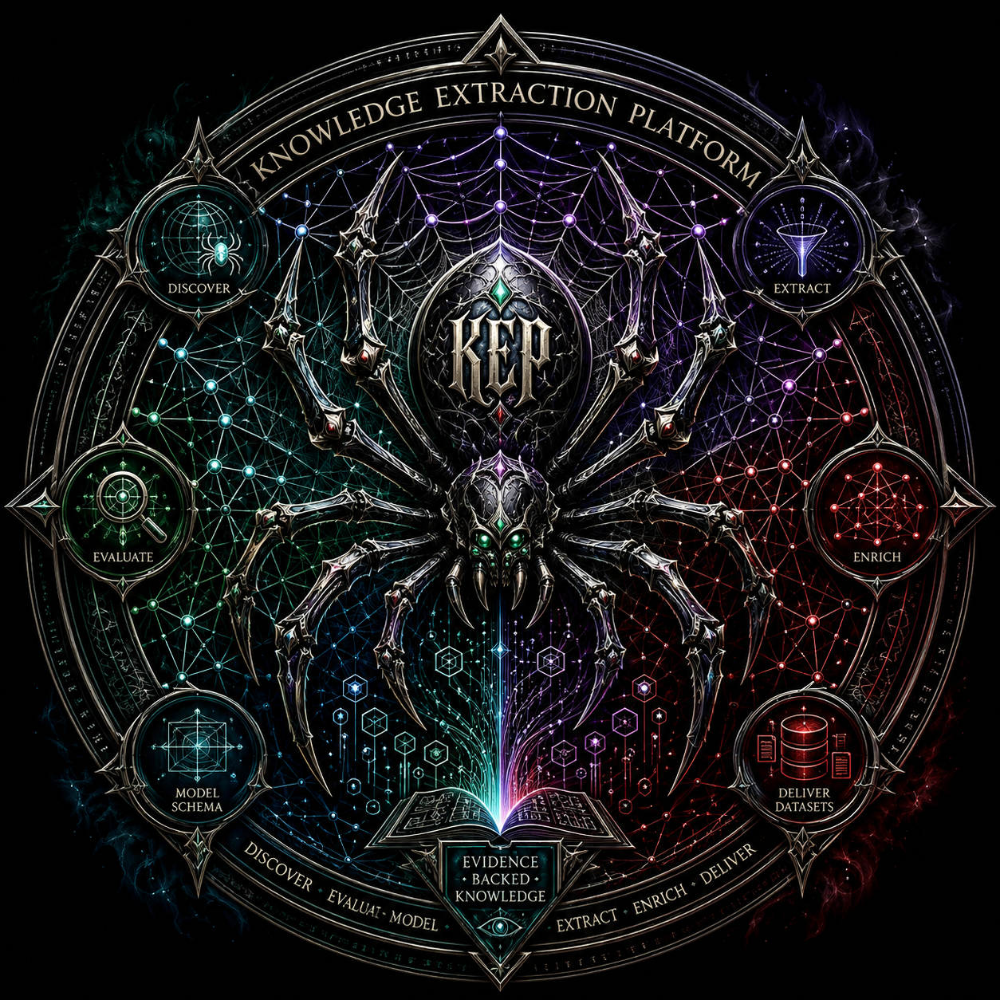
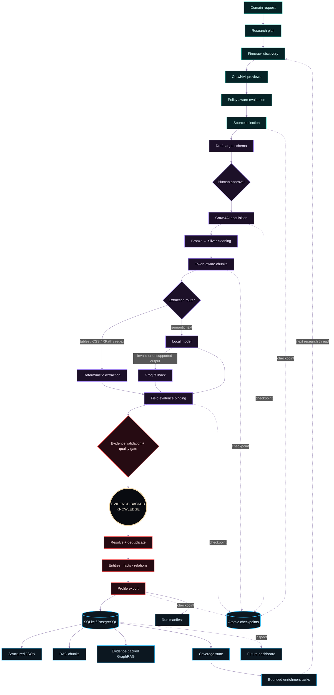
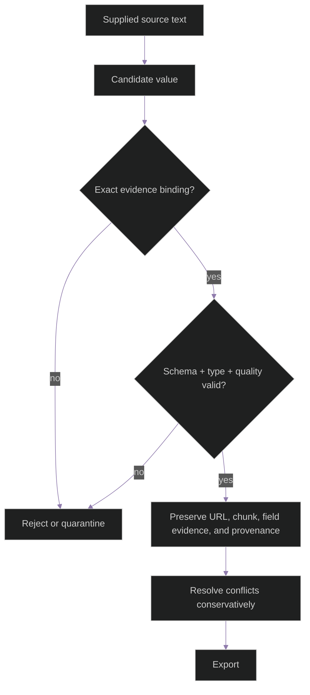
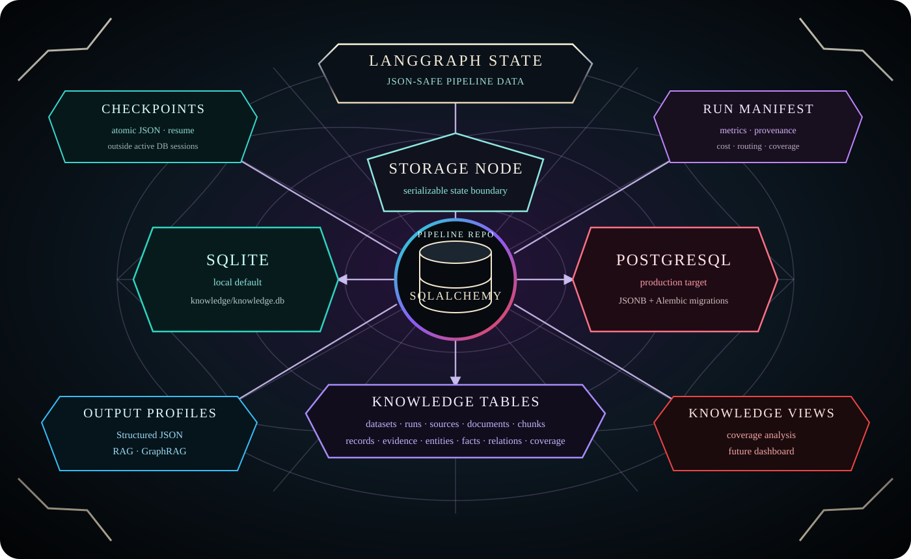
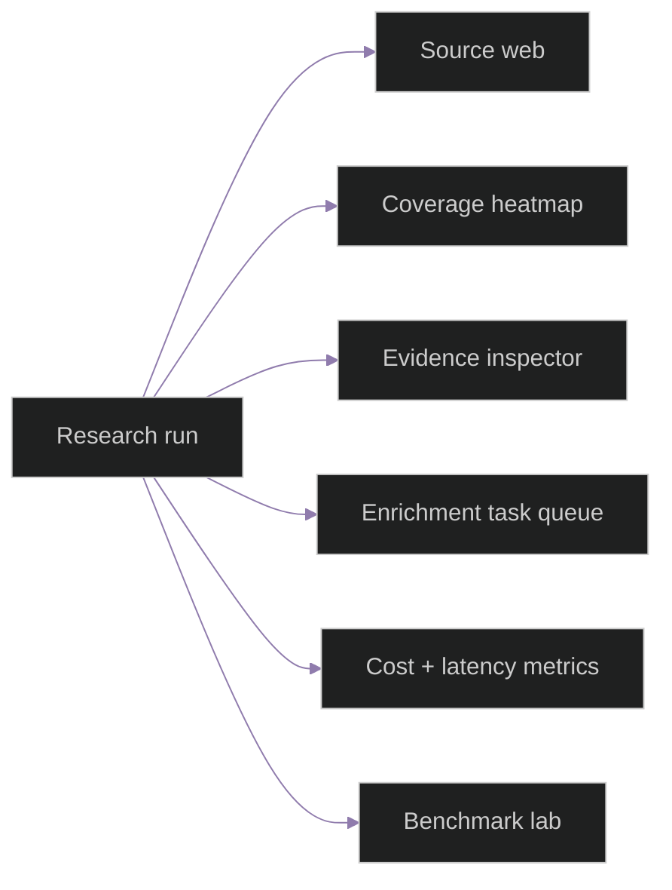
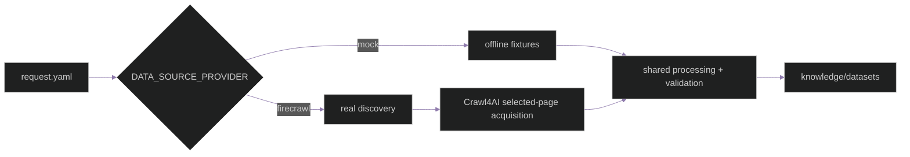

<p align="center"></p>

# 🕸️ Knowledge Extraction Agent

<p align="center"><strong>Turn the open web into evidence-backed knowledge.</strong><br>A friendly research spider for structured datasets, RAG, GraphRAG, and future knowledge applications.</p>

<p align="center">   </p>

## The idea in one picture

This is not a chatbot. It is a research-to-knowledge pipeline: a domain request becomes a reviewed schema, selected sources become acquired documents, documents become verified records, and the same evidence can feed several output profiles.

<p align="center"></p>

## The architecture web

The platform is one connected evidence web rather than a chain of isolated agents. Every outer thread returns to the same center: source-backed knowledge with preserved provenance.



## What can you build with it?

| Use case | What the spider delivers |
| --- | --- |
| **Structured datasets** | Validated records with field-level evidence and provenance |
| **RAG ingestion** | Retrieval documents made directly from evidence-preserving chunks |
| **GraphRAG foundations** | Entities, claims, and relations traceable to supplied text |
| **Research automation** | Bounded discovery, preview, acquisition, and enrichment |
| **Evaluation** | Frozen gold fixtures, quality metrics, provider comparisons, and checkpoints |
| **Future dashboard** | A visual run console for sources, coverage, evidence, tasks, cost, and latency |

## Why the web metaphor matters

Every “thread” has a job and a boundary:

```text
🕷️ Research      plans the hunt; it does not browse
🕸️ Firecrawl     discovers candidates; it does not decide truth
🧭 Crawl4AI      previews and acquires selected pages
🧪 Extraction    prefers deterministic rules before probabilistic models
🔎 Evidence      binds every accepted value to supplied source text
🗃️ Knowledge     stores records, entities, facts, relations, and provenance
📦 Profiles      export the same run as Structured, RAG, or GraphRAG output
```

### Crawl4AI, explained simply

[Crawl4AI](https://github.com/unclecode/crawl4ai) is the page-acquisition layer. In this project it provides browser-based previews, controlled page retrieval, Markdown/HTML content, links, caching, bounded concurrency, and local-fixture testing. It is deliberately not the “brain”: it does not choose dataset fields, invent facts, assign final confidence, or write knowledge records.

[Firecrawl](https://www.firecrawl.dev/) is used at the discovery boundary to search for candidate URLs. The application evaluates those candidates against the user’s explicit source policy and sends only selected pages to the acquisition provider.

## Quality is a gate, not a feeling



The core rules are intentionally strict:

- no fabricated values;
- no hidden source allowlists when policy fields are omitted;
- no co-occurrence-only GraphRAG relations;
- no destructive deduplication that loses evidence;
- no local-model promotion without comparable benchmark evidence.

## Current build

The implementation has moved beyond a simple scraper into a resumable knowledge pipeline:

| Layer | Current capability |
| --- | --- |
| **Configuration** | Domain-specific YAML requests, source policy, schema constraints, and output profiles |
| **Web** | Firecrawl discovery boundary plus Crawl4AI preview/acquisition boundary |
| **Processing** | Bronze acquisition → deterministic Silver cleaning → token-aware chunks |
| **Extraction** | CSS/XPath/regex/table routes first, structured generation as fallback |
| **Knowledge** | Persistent sources, documents, chunks, records, entities, facts, relations, and evidence |
| **Reliability** | Manifest metrics, atomic checkpoints, schema approval, resume, bounded retries |
| **AI routing** | Benchmark-gated local-first path with Groq fallback when configured |

## The persistence web

The database is not the orchestrator and never owns crawler or model clients. LangGraph passes JSON-safe state into `storage_node`; `PipelineRepository` maps that state through SQLAlchemy to the configured database while checkpoints and manifests remain explicit resumable artifacts.

<p align="center"></p>

```text
DATABASE_URL absent
    → sqlite:///knowledge/knowledge.db

storage.database_url or DATABASE_URL configured
    → PostgreSQL for production deployments

Both backends preserve
    → datasets · runs · sources · documents · chunks
    → records · field evidence · entities · facts · relations · coverage
```

SQLite is the zero-configuration local default. PostgreSQL uses the same repository contract, PostgreSQL-native JSONB variants, and Alembic migrations for production evolution. Database sessions stay inside `src/storage/`; only serializable identifiers, counts, and metrics return to graph state.

### Recent milestones

```text
✅ Phase 28  Persistent storage with PostgreSQL / SQLite and migrations
✅ Phase 29  High-volume multi-record ingestion and yield metrics
✅ Phase 30  Entity resolution, facts, relations, and conflict preservation
✅ Phase 31  Coverage analysis and bounded enrichment task planning
✅ Phase 32  Local-first routing with benchmark evidence and cloud fallback
🚧 Next      Dashboard, larger real-world gold sets, and benchmark expansion
```

### Benchmark snapshot

The current routed extraction benchmark is an offline/frozen engineering comparison, not a live-web quality promise.

| Metric | Routed local-first | Groq-only comparison |
| --- | ---: | ---: |
| Record recall | 0.9167 | 0.8333 |
| Field precision | 0.9697 | 0.7586 |
| Field recall | 0.9143 | 0.6286 |
| Unsupported accepted fields | 0.0000 | 0.0000 |
| Schema validity | 1.0000 | — |
| Cloud fallback rate | 0.25 | — |

The harness makes model or provider changes visible. It does not imply that every domain, language, website, or live provider will produce the same result.

## Future dashboard: from terminal spider to research cockpit

The terminal runner is the current presentation layer. A future dashboard will sit on the same serializable `AgentState` and checkpoint contracts, so the UI can visualize a run without rewriting the pipeline:



Planned views include source eligibility and diversity, schema approval, crawl health, evidence inspection, unresolved coverage, enrichment rounds, provider routing, token/cost usage, and benchmark deltas.

## Quick start

The repository uses the dedicated `.venv` interpreter for every command.

```powershell
py -3.12 -m venv .venv
.\.venv\Scripts\python.exe -m pip install -r requirements-baseline.txt
Copy-Item .env.example .env
```

Run the offline mock domain:

```powershell
.\.venv\Scripts\python.exe run_domain_test.py --domain turkish_culture --approve-schema
```

For the human-in-the-loop flow, remove `--approve-schema`. Review `knowledge/review/`, then approve it in the terminal. To continue a saved checkpoint:

```powershell
.\.venv\Scripts\python.exe run_domain_test.py --domain turkish_culture --resume
```

Other example domain: `space_science`.

Create a new domain by copying `configs/domains/turkish_culture/request.yaml` into `configs/domains/<your_domain>/request.yaml` and changing the topic, purpose, source policy, schema, and output settings. The `--domain` value is the directory name under `configs/domains/`.

## Run modes and outputs



Mock mode needs no provider key. Real mode needs credentials and network access. Local-model routing is optional and benchmark-gated; it does not silently replace Groq unless the local backend is enabled and approved.

The output profiles are independent views over shared evidence:

- `structured`: accepted records, metadata, quality, field evidence, and provenance;
- `rag`: one retrieval document per evidence-preserving chunk;
- `graphrag`: traceable entities, claims, and relations only.

Each run can also write a manifest and resumable checkpoint beside the dataset. Keep checkpoints when using `--resume`.

## Project map

```text
configs/domains/                 domain requests and schemas
run_domain_test.py                terminal entry point
src/agents/graphs/                canonical LangGraph orchestration
src/agents/nodes/                 planning, crawling, extraction, evidence, knowledge
src/tools/web/                    Firecrawl and Crawl4AI provider boundaries
src/tools/structured_generation/  local and Groq adapters + router
src/storage/                      persistent models and repositories
src/schemas/                      Pydantic contracts
tests/evaluation/                 frozen gold sets and benchmark gates
docs/                             architecture, rules, phases, and progress records
knowledge/datasets/               generated outputs and manifests
```

## Verification

```powershell
.\.venv\Scripts\python.exe -m pytest -q
.\.venv\Scripts\python.exe -m compileall -q src scripts tests
```

The last recorded offline acceptance run passed `283` tests with `13` opt-in skips. Local-browser Crawl4AI checks are separate from the offline suite; live Firecrawl/Groq checks are opt-in and credential-dependent.

## Design documents

- [`docs/ARCHITECTURE.md`](docs/ARCHITECTURE.md) — intended system and data contracts
- [`docs/RULES.md`](docs/RULES.md) — engineering and safety rules
- [`docs/PHASES.md`](docs/PHASES.md) — ordered roadmap and acceptance gates
- [`docs/DEVELOPMENT_PROGRESS.md`](docs/DEVELOPMENT_PROGRESS.md) — verified implementation journal

## Project status

This is an actively evolving research and engineering project. Provider SDK behavior, model availability, and live-site rendering can change; use frozen fixtures and manifests for reproducible comparisons, and treat live runs as provider-dependent experiments.
